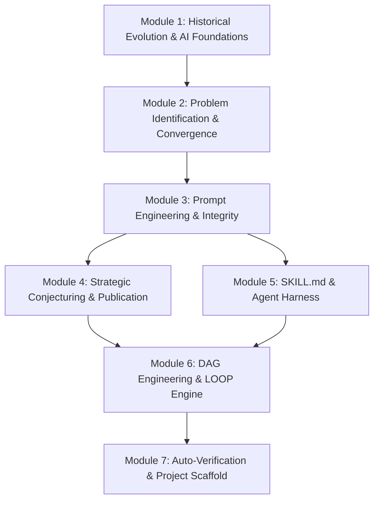

# AI-Powered Mathematical Research
## From Formal Prompting to Autonomous Verification and Lean Proof Systems

**Course Code**: `AIMR501`  
**Format**: Self-Learning Microlearning Program  
**Author / Instructor**: Sanjay Chitnis  
**Stream**: AI Research & Mathematical Sciences  
**Target Audience**: Pure & Applied Mathematics Faculty, Postdoctoral Fellows, Doctoral Advisors, Computational Mathematicians, and AI Researchers  

---

## 🌟 Course Overview

**AI-Powered Mathematical Research** is a self-paced microlearning program designed to transform how mathematical research is conducted in the AI era. It treats Large Language Models as research collaborators whose output is unverified until independently validated by a compiler (Lean 4 / Mathlib4), a computer algebra system (SageMath/SymPy), or a human referee.

Participants progress through seven modular units, mastering historical paradigm shifts (Donald Knuth, TeX, Universal Approximation Theorem), rhetorical prompt engineering (Ethos, Pathos, Logos), 5-gate paper construction, white-collar agentic delegation (Google Antigravity SDK, Agent Harness), specialized SKILL.md specs, Directed Acyclic Graph (DAG) workflow orchestration, and compiler-grade auto-verification project scaffolds.

---

## 🎯 Key Learning Objectives

By completing this self-learning microlearning program, you will be able to:

1. **Analyze Historical & AI Bedrock**: Trace the evolution from TeX to Lean 4, analyze Knuth's "Shock! Shock!" memo, and apply the Universal Approximation Theorem as AI's mathematical foundation.
2. **Map Literature Gaps**: Execute structured SOTA surveys on arXiv, MathSciNet, zbMATH, and OEIS to systematically locate open research problems.
3. **Apply Rigorous Prompting & Mitigate AI Limits**: Use Ethos, Pathos, and Logos mode translation, mitigate AI limitations (hallucinations, Jagged Intelligence Edge) via programmatic REST API retrieval, and maintain a Proof Dependency Ledger.
4. **Master 5-Gate Paper Workflows**: Execute the 5-Gate Zero-to-One Paper Construction pipeline and run simulated referee reports.
5. **Deploy Agentic Harness & SKILL.md Specs**: Delegate white-collar tasks via Google Antigravity SDK and specialized agents (`Literature-Conjecture-Agent`, `Proof-Strategy-Agent`, `Lean4-Formalization-Agent`, `Counterexample-Search-Agent`).
6. **Orchestrate DAG & LOOP Engine**: Model proof development as a Directed Acyclic Graph (DAG) with Human-in-the-Loop (HITL) checkpoints and run stateful research loops.
7. **Master Compiler Auto-Verification**: Formalize mathematical arguments in Lean 4 with Mathlib4 imports, using clean `lake build` compilation (`sorry_count = 0`) as the definition of done.

---

## 📚 Module Breakdown

### Module 1: Historical Evolution & AI Foundations in Mathematics
- Knuth's TeX story & "Shock! Shock!" (2024) memo
- Universal Approximation Theorem (Cybenko, Hornik) & AI Bedrock
- Open math problems solved by AI & Global AI Math Race

### Module 2: Identifying the Research Problem & Literature Convergence
- Expertise and interest elicitation prompting
- SOTA literature gap mapping across arXiv, MathSciNet, zbMATH, OEIS
- Iterative problem statement convergence loop

### Module 3: Foundational Prompt Engineering & Mathematical Integrity
- Rhetorical prompt mode translation (Ethos, Pathos, Logos)
- AI core limitations, Jagged Intelligence Edge, & Programmatic REST API retrieval
- Four Qualifiers for Mathematical Integrity & Proof Dependency Ledger

### Module 4: Strategic Conjecturing & Publication Workflows
- Gap-mapping prompts for conjecture generation with search provenance
- Do's and Don'ts matrix of AI math research
- 5-Gate Zero-to-One Paper Construction & Referee Simulation

### Module 5: Autonomous Agent Architecture & SKILL.md Foundations
- White-collar task delegation, Agent Harness, & Google Antigravity SDK
- SKILL.md specs for specialized mathematical research agents
- Lean 4 formalization agent & SageMath counterexample search agent

### Module 6: Graph Engineering, Workflow Orchestration & The LOOP Engine
- DAG topology for proof dependencies and HITL checkpoints
- Schema-enforced inter-agent context handoffs
- The Look-Orient-Operate-Ponder (LOOP) operational engine

### Module 7: Auto-Research Loops, Formal Auto-Verification & Project Scaffolding
- 4-Part Claim Validation Test (Surprising, Fruitful, Rigorous, Feasible)
- Compiler-grade auto-verification (`sorry_count = 0`) and proof EVALs
- Standardized project scaffold repository (`PROJECT_BRIEF.md`, `lean/`, `wiki/`, `paper/`)

---

## 🛠️ Essential Tools & Environment

* **Proof Systems**: Lean 4, Lake, Mathlib4
* **Computer Algebra Systems**: SageMath, SymPy
* **Literature Databases**: arXiv, MathSciNet, zbMATH, OEIS
* **Agent Infrastructure**: SKILL.md Agent Specifications, NotebookLM
* **Documentation Scaffold**: Markdown, Obsidian `[[wikilinks]]`, Mermaid diagrams

---

## 🖥️ Interactive Presentation & Microlearning Deck

Explore the interactive slide deck compiled using Srujana-Bodha Presentation Creator:

- 🔗 [Launch Full-Screen Presentation Deck](pathname:///presentations/ai-math-research/)

<iframe src="/presentations/ai-math-research/index.html" width="100%" height="600px" style={{ border: 'none', borderRadius: '8px', boxShadow: '0 4px 12px rgba(0,0,0,0.1)' }} allowFullScreen />

---

## 📖 Source Material & Full Course Descriptor

- Full Guide: [AI-Powered Mathematical Research Guide](file:///d:/Github/CourseDesign/ai-researcher/AI-Powered-Mathematical-Research.md)
- Program Syllabus: [AI Math Research Syllabus](file:///d:/Github/CourseDesign/ai-researcher/syllabus-ai-math-research.md)
- Course Descriptor: [AI Math Research Descriptor](file:///d:/Github/CourseDesign/ai-researcher/course-descriptor-ai-math-research.md)

---
#REVAuniversity #AIMicrolearning #EducateToEnterprise #Lean4 #Formalization #SanjayChitnis
