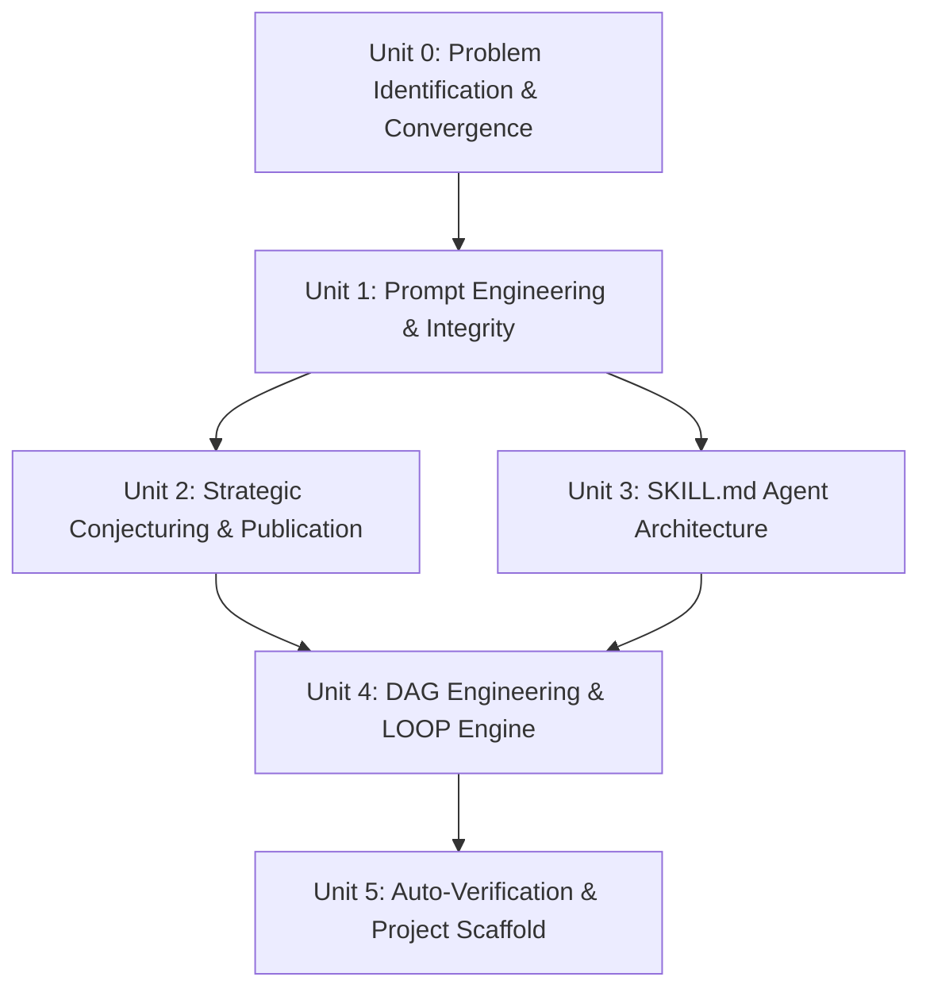

# AI-Powered Mathematical Research
## From Formal Prompting to Autonomous Verification and Lean Proof Systems

**Course Code**: `AIMR501`  
**Format**: Self-Learning Microlearning Program  
**Author / Instructor**: Sanjay Chitnis  
**Stream**: AI Research & Mathematical Sciences  
**Target Audience**: Pure & Applied Mathematics Faculty, Postdoctoral Fellows, Doctoral Advisors, Computational Mathematicians, and AI Researchers  

---

## 🌟 Course Overview

**AI-Powered Mathematical Research** is a self-paced microlearning program designed to transform how mathematical research is conducted in the AI era. It treats Large Language Models as research collaborators whose output is unverified until independently validated by a compiler (Lean 4 / Mathlib4), a computer algebra system (SageMath/SymPy), or a human referee.

Participants progress through six modular units, mastering rhetorical prompt engineering (Ethos, Pathos, Logos), 5-gate paper construction, specialized agentic SKILL.md specifications, Directed Acyclic Graph (DAG) workflow orchestration, and compiler-grade auto-verification project scaffolds.

---

## 🎯 Key Learning Objectives

By completing this self-learning microlearning program, you will be able to:

1. **Map Literature Gaps**: Execute structured SOTA surveys on arXiv, MathSciNet, and zbMATH to systematically locate open research problems.
2. **Apply Rigorous Prompting**: Use Ethos, Pathos, and Logos mode translation while enforcing the Four Qualifiers for Mathematical Integrity (Logical Soundness, Originality, IP, Hallucination Elimination).
3. **Construct Proof Dependency Ledgers**: Build stage-chained CoT prompt workflows that prevent unverified proof gaps from propagating into formalization attempts.
4. **Deploy Agentic SKILL.md Specs**: Use specialized AI agents (`Literature-Conjecture-Agent`, `Proof-Strategy-Agent`, `Lean4-Formalization-Agent`, `Counterexample-Search-Agent`) to automate research workflows.
5. **Run Computational Stress Tests**: Write SageMath/SymPy scripts to computationally search for counterexamples before committing effort to formal proofs.
6. **Master Compiler Auto-Verification**: Formalize mathematical arguments in Lean 4 with Mathlib4 imports, using clean `lake build` compilation (`sorry_count = 0`) as the definition of done.

---

## 📚 Unit Breakdown

### Unit 0: Identifying the Research Problem & Iterative Convergence
- Expertise and interest elicitation prompting
- SOTA literature gap mapping across arXiv, MathSciNet, zbMATH
- Iterative problem statement convergence loop

### Unit 1: Foundational Prompt Engineering for Mathematical Research
- Rhetorical prompt mode translation (Ethos, Pathos, Logos)
- Four Qualifiers for Mathematical Integrity
- Proof Dependency Ledger & Stage-Chained CoT Prompting

### Unit 2: Strategic Research, Conjecturing & Publication Best Practices
- Literature-grounded gap mapping for conjecture generation
- Do's and Don'ts of AI-assisted math research
- 5-Gate Zero-to-One Paper Construction & Referee Simulation

### Unit 3: Autonomous Agent Architecture & SKILL.md Foundations
- SKILL.md specs for specialized mathematical research agents
- Lean 4 formalization agent with `lake build` validation feedback loop
- SageMath counterexample search agent & NotebookLM integration

### Unit 4: Graph Engineering, Workflow Orchestration & The LOOP Engine
- DAG topology for proof dependencies and HITL checkpoints
- Schema-enforced inter-agent context handoffs
- The Look-Orient-Operate-Ponder (LOOP) operational engine

### Unit 5: Auto-Research Loops, Formal Auto-Verification & Project Scaffolding
- 4-Part Claim Validation Test (Surprising, Fruitful, Rigorous, Feasible)
- Compiler-grade auto-verification (`sorry_count = 0`) and proof EVALs
- Standardized project scaffold repository (`PROJECT_BRIEF.md`, `lean/`, `wiki/`, `paper/`)

---

## 🛠️ Essential Tools & Environment

* **Proof Systems**: Lean 4, Lake, Mathlib4
* **Computer Algebra Systems**: SageMath, SymPy
* **Literature Databases**: arXiv, MathSciNet, zbMATH, OEIS
* **Agent Infrastructure**: SKILL.md Agent Specifications, NotebookLM
* **Documentation Scaffold**: Markdown, Obsidian `[[wikilinks]]`, Mermaid diagrams

---

## 🖥️ Interactive Presentation & Microlearning Deck

Explore the interactive slide deck compiled using Srujana-Bodha Presentation Creator:

- 🔗 [Launch Full-Screen Presentation Deck](/presentations/ai-math-research/)

<iframe src="/presentations/ai-math-research/" width="100%" height="600px" style={{ border: 'none', borderRadius: '8px', boxShadow: '0 4px 12px rgba(0,0,0,0.1)' }} allowFullScreen />

---

## 📖 Source Material & Full Course Descriptor

- Full Guide: [AI-Powered Mathematical Research Guide](file:///d:/Github/CourseDesign/ai-researcher/AI-Powered-Mathematical-Research.md)
- Program Syllabus: [AI Math Research Syllabus](file:///d:/Github/CourseDesign/ai-researcher/syllabus-ai-math-research.md)
- Course Descriptor: [AI Math Research Descriptor](file:///d:/Github/CourseDesign/ai-researcher/course-descriptor-ai-math-research.md)

---
#REVAuniversity #AIMicrolearning #EducateToEnterprise #Lean4 #Formalization #SanjayChitnis
