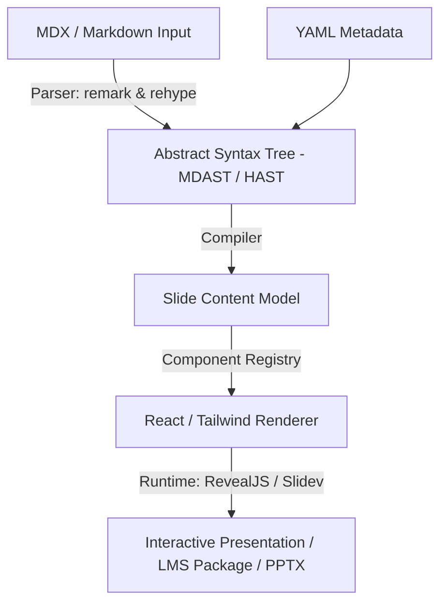

# Interactive Presentation Specification (IPS)

Version 1.0

This document defines the **Interactive Presentation Specification (IPS)** for the `presentation-creator` tool. The objective is to establish an AI-native, human-editable, React-rendered, interactive, LMS-compatible, and presentation-grade standard for slide decks.

---

## 1. Architectural Blueprint

The architecture combines authoring simplicity with powerful rendering and portability:



### Core Design Goals
* **Human Writable**: Easy to edit using simple Markdown/MDX text.
* **AI Generatable**: Structured in a way that LLMs can accurately generate entire presentations.
* **Schema Validatable**: Uses JSON Schema to validate slide structures and metadata block types.
* **React Renderable**: Leverages React component registries for rich interactivity.
* **LMS Compatible**: Directly exportable as SCORM/xAPI packages.
* **Multi-target Export**: Portable content that converts cleanly to PPTX, PDF, and static HTML.

---

## 2. Input Authoring Format

### Presentation-Level Frontmatter
Each presentation starts with a YAML frontmatter block containing global metadata:

```markdown
---
specVersion: 1.0
title: AI in Higher Education
subtitle: Strategic Roadmap
author: Dr. Sanjay Chitnis
theme: university-corporate
aspectRatio: 16:9
audience:
  - board
  - faculty
objectives:
  - Understand AI strategy
  - Approve implementation roadmap
---

# Section: Executive Overview
```

### Slide Separation
Slides are separated using a horizontal rule (`---`) with inline YAML frontmatter defining slide-level configurations:

```markdown
---
slideId: slide-001
layout: hero
purpose: introduce
duration: 90
importance: high
---

# AI Strategy 2030

Transforming Learning and Administration
```

---

## 3. Slide Metadata Specification

Every slide can define the following metadata vocabulary:

| Field | Type | Description |
| :--- | :--- | :--- |
| `slideId` | `string` | Unique identifier for tracking, analytics, and linking. |
| `title` | `string` | Title of the slide (for index lists and accessibility). |
| `layout` | `string` | Layout component name (e.g. `hero`, `comparison`). |
| `purpose` | `string` | Informational purpose (e.g. `persuade`, `define`, `summarize`). |
| `duration` | `number` | Target presentation time in seconds. |
| `importance` | `string` | Slide importance rank (`critical`, `normal`, `optional`). |
| `tags` | `string[]` | Custom categorization tags. |
| `learningObjective` | `string[]`| Mapped curriculum learning outcomes. |
| `interactionLevel` | `string` | Interactive complexity (`none`, `low`, `medium`, `high`). |
| `animation` | `string` | Slide transition animation style. |
| `accessibility` | `object` | Screen reader and contrast configurations. |

---

## 4. Layout Directory

The renderer supports a fixed vocabulary of layout components:

### Basic & Section Layouts
* `hero`: Central high-impact presentation title.
* `title`: Regular slide title layout.
* `section`: Section division divider slide.
* `agenda`: Summary index of upcoming topics.
* `content`: Standard layout for body copy.
* `summary`: Bulleted takeaways or wrap-ups.
* `thankyou`: Standard closing slide.

### Structural Content Layouts
* `single-column` / `two-column` / `three-column`: Grid layouts.
* `content-image` / `image-content`: Side-by-side media.
* `comparison`: Pro/con or feature comparative grids.
* `process` / `timeline` / `roadmap`: Sequential progression charts.
* `quote`: Stylized testimonial block.
* `story`: Immersive text-heavy narrative structure.

### Data & Strategy Layouts
* `table` / `metrics` / `kpi-dashboard`: Numerical data boards.
* `chart` / `chart-insights`: Graphical visual insights.
* `heatmap` / `scorecard`: Color-coded metrics.
* `swot` / `pestle`: Traditional business quadrants.
* `business-model-canvas` / `strategy-map` / `value-chain`: Strategic maps.

### Academic & Research Layouts
* `concept` / `definition`: Conceptual cards.
* `case-study` / `research-paper`: Structured abstract/findings layouts.
* `methodology` / `results` / `discussion` / `references`: Academic reporting layouts.

---

## 5. Standard MDX Semantic Blocks

Semantic blocks are defined using standard MDX JSX tags or native Markdown components to ensure 100% compatibility with standard MDX compilers and Docusaurus sites:

### Metrics Component
```mdx
<Metric 
  label="Enrollment" 
  value="35,000" 
  trend="+12%" 
/>
```

### Insight Block
Standard blockquotes represent qualitative slides insights:
```markdown
> 💡 Enrollment growth is driven primarily by online programs.
```

### Admonition Callout
Uses standard Docusaurus admonitions (note, tip, info, caution, warning, danger, success) for callouts:
```markdown
:::success
AI adoption exceeded expectations.
:::
```

### Media Elements
Standard HTML5 media and markdown elements:
```markdown


<video src="media/intro.mp4" controls autoplay={false} />
```

### Chart Component Block
```mdx
<Chart 
  type="line" 
  dataset="enrollment-data" 
  x="year" 
  y="students" 
/>
```

---

## 6. MDX Support

Any slide can include dynamic React widgets. The renderer resolves components through the `ComponentRegistry`:

```mdx
<EnrollmentCalculator defaultRate={0.08} />
<ROIWidget target="year3" />
<SimulationEngine scenario="high-growth" />
```

### Registry Structure
```typescript
const ComponentRegistry = {
  EnrollmentCalculator,
  ROIWidget,
  SimulationEngine,
  Metric,
  Chart,
  Quiz,
  QRCode,
  // Custom user-defined widgets
};
```

### Supported Component Categories
1. **Visualization**: Recharts, D3, Nivo, Plotly, Vega.
2. **Interactive**: Sliders, calculators, flow simulators, what-if tools.
3. **AI Components**:
   * `<AskAI />` (prompting panel within slide context).
   * `<AITutor />` (conversational learning helper).
   * `<AIReflectionAssistant />` (guided self-assessments).

---

## 7. Interactive Learning Components

This section details the Markdown directives for H5P-style interactive learning components. Authors write simple Markdown directive blocks (`:::component-name`), which are parsed into an intermediate JSON AST, compiled into MDX, and rendered dynamically in the React runtime.

### 1. Accordion (Content Component)
* **Purpose**: Reveal collapsible content sections.
* **Syntax**:
  ```markdown
  :::accordion
  ## Definition
  Content goes here.
  ## Example
  Example content.
  :::
  ```
* **JSON AST**:
  ```json
  {
    "type": "accordion",
    "items": [
      { "title": "Definition", "content": "Content goes here." },
      { "title": "Example", "content": "Example content." }
    ]
  }
  ```
* **Validation**: Must contain at least one H2 (`##`) heading followed by content lines.

### 2. Tabs (Content Component)
* **Purpose**: Toggle content categories in horizontal tabs.
* **Syntax**:
  ```markdown
  :::tabs
  === Theory
  Theory content.
  === Example
  Example content.
  :::
  ```
* **JSON AST**:
  ```json
  {
    "type": "tabs",
    "items": [
      { "label": "Theory", "content": "Theory content." },
      { "label": "Example", "content": "Example content." }
    ]
  }
  ```
* **Validation**: Sections delimited by `===` prefix.

### 3. Flashcards (Knowledge Check Component)
* **Purpose**: Present interactive flip cards with questions and answers.
* **Syntax**:
  ```markdown
  :::flashcards
  Q: What is polymorphism?
  A: The ability to take multiple forms.
  :::
  ```
* **JSON AST**:
  ```json
  {
    "type": "flashcards",
    "cards": [
      { "question": "What is polymorphism?", "answer": "The ability to take multiple forms." }
    ]
  }
  ```

### 4. Multiple Choice Question (Assessment Component)
* **Purpose**: Evaluate mastery through single/multi-choice checks.
* **Syntax**:
  ```markdown
  :::mcq
  question: Which is a primary color?
  [x] Red
  [ ] Green
  [ ] Black
  explanation: Red is a primary color.
  :::
  ```
* **JSON AST**:
  ```json
  {
    "type": "mcq",
    "question": "Which is a primary color?",
    "options": [
      { "text": "Red", "correct": true },
      { "text": "Green", "correct": false },
      { "text": "Black", "correct": false }
    ],
    "explanation": "Red is a primary color."
  }
  ```

### 5. True / False (Assessment Component)
* **Purpose**: Evaluate concepts with boolean statements.
* **Syntax**:
  ```markdown
  :::truefalse
  answer: true
  The Earth revolves around the Sun.
  explanation: Earth orbits the Sun every year.
  :::
  ```

### 6. Fill in the Blanks (Assessment Component)
* **Purpose**: Enter missing words inline.
* **Syntax**:
  ```markdown
  React was created by [[Facebook]].
  React was developed by [[Facebook|Meta]].
  ```
* **JSON AST**:
  ```json
  {
    "type": "fill-blanks",
    "text": "React was created by [[Facebook]].",
    "blanks": [
      { "correct": ["Facebook"] },
      { "correct": ["Facebook", "Meta"] }
    ]
  }
  ```

### 7. Matching Activity (Assessment Component)
* **Purpose**: Pair items to associate definitions.
* **Syntax**:
  ```markdown
  :::matching
  HTML => Structure
  CSS => Styling
  JavaScript => Behavior
  :::
  ```
* **JSON AST**:
  ```json
  {
    "type": "matching",
    "pairs": [
      { "source": "HTML", "target": "Structure" },
      { "source": "CSS", "target": "Styling" }
    ]
  }
  ```

### 8. Sortable Sequence (Assessment Component)
* **Purpose**: Reorder steps or stages chronologically.
* **Syntax**:
  ```markdown
  :::sequence
  1. Requirements
  2. Design
  3. Development
  4. Testing
  :::
  ```

### 9. Timeline (Content Component)
* **Purpose**: Present vertical interactive chronologies.
* **Syntax**:
  ```markdown
  :::timeline
  height: 400px
  orientation: vertical

  1995 | JavaScript Released
  Created for Netscape.
  
  2009 | Node.js
  Server-side JavaScript.
  :::
  ```

### 10. Image Hotspots (Content Component)
* **Purpose**: Select nodes on a reference graphic to reveal tooltips.
* **Syntax**:
  ```markdown
  :::hotspots
  image: architecture.png
  (25,40)
  Database
  Stores application data.
  :::
  ```

### 11. Before / After Image Comparison (Content Component)
* **Purpose**: Slide horizontal handle to compare two states.
* **Syntax**:
  ```markdown
  :::compare
  before: before.jpg
  after: after.jpg
  height: 300px
  labelBefore: Before Revision
  labelAfter: After Revision
  sliderPosition: 50
  :::
  ```
  ```

### 12. Quiz Group (Assessment Component)
* **Purpose**: Aggregate multiple questions into a test form with score counts.
* **Syntax**:
  ```markdown
  :::quiz
  :::mcq
  question: What is React?
  [x] Library
  [ ] OS
  :::
  :::truefalse
  answer: true
  JavaScript runs in browsers.
  :::
  :::
  ```

### 13. Information Cards Grid (Content Component)
* **Purpose**: Display keyword summary cards in a responsive grid.
* **Syntax**:
  ```markdown
  :::cards
  Card: Encapsulation
  Protects internal state.
  Card: Inheritance
  Supports reuse.
  :::
  ```

### 14. Interactive Book (Navigation Component)
* **Purpose**: Frame long-form pedagogy into chapters.
* **Syntax**:
  ```markdown
  # Introduction
  Content...
  ---chapter---
  # Foundations
  Content...
  ```


---

## 8. AI-Specific Layer

Enables context-aware operations per slide:

```yaml
ai:
  objective: persuade
  keyPoint: AI reduces operational friction
  speakerTone: executive
  speakerLevel: beginner
  generateNarration: true
  generateQuiz: true
  generateSummary: true
```

---

## 9. Speaker Notes

```markdown
:::notes
Discuss cost reduction.
Mention pilot results.
Emphasize faculty support.
:::
```
Notes are rendered exclusively in **Presenter View**.

---

## 10. Accessibility & Compliance

```yaml
accessibility:
  altTextRequired: true
  readingLevel: grade10
  keyboardNavigation: true
  highContrast: true
```

---

## 11. Renderer Specification & Tech Stack

```text
MDX Source File ──> [ remark & rehype ] ──> AST ──> [ MDX Runtime ] ──> Component Registry ──> React Renderer
```

### Technology Stack
* **Parsing**: `remark` (markdown parsing), `rehype` (HTML processing), `mdast` (AST tree compiler), and `@mdx-js/mdx` (React integration compiler).
* **Presentation Runtime**: RevealJS (mature presentation framework), Slidev (markdown presentation compiler), or Spectacle (React presentation engine).
* **Charts**: Recharts, Nivo, Vega-Lite, Plotly.
* **H5P Integration**: Native IPS UI React components mapped to H5P schemas.

---

## 12. Canonical Slide Example

A complete IPS compliant slide combines frontmatter, markdown, interactive components, charts, and notes:

```markdown
---
slideId: s23
title: AI Adoption Impact
layout: chart-insights
purpose: persuade
duration: 90
learningObjective:
  - Evaluate AI adoption trends
interactionLevel: high
---

# AI Adoption Impact

<Chart 
  type="line" 
  dataset="ai-adoption" 
  x="year" 
  y="adoption" 
/>

> 💡 AI adoption increased 240% over three years.

<Quiz 
  type="mcq"
  question="Which factor contributed most?"
  a="Culture"
  b="Leadership"
  c="Hardware"
  d="Regulatory support"
  correct="b"
/>

<ROIWidget />

:::notes
Ask audience about their own adoption challenges.
:::
```
